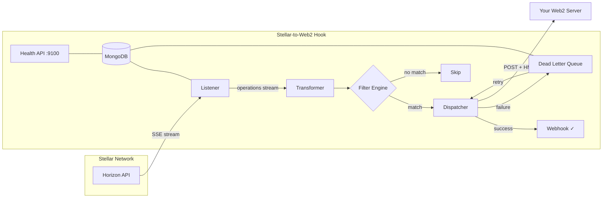

# ★ Stellar-to-Web2 Hook

<div align="center">

**A production-grade bridge that streams Stellar network operations in real-time and dispatches HMAC-signed webhook payloads to your Web2 endpoints.**

[](https://nodejs.org/)
[](https://www.stellar.org/)
[](https://www.mongodb.com/)
[](https://www.docker.com/)
[](https://opensource.org/licenses/MIT)

</div>

---

## Architecture



## Features

| Feature | Description |
|---|---|
| **Multi-Operation Streaming** | Payments, account creates/merges, trustlines, DEX offers — not just payments |
| **Cursor Persistence** | Paging tokens saved in MongoDB — zero data loss on restart |
| **Dynamic Watch Filters** | Filter by account, asset code, minimum amount, and operation types |
| **HMAC-SHA256 Signatures** | Every webhook includes an `X-Stellar-Signature` header for verification |
| **Dead Letter Queue** | Failed webhooks are persisted and retried automatically with exponential backoff |
| **Health & Status API** | Built-in HTTP API for monitoring, metrics, and DLQ management |
| **429 Rate Limit Handling** | Automatic exponential backoff on Horizon rate limits |
| **Config Hot-Reload** | Edit `config.json` on the fly — no restart needed |
| **CLI Dashboard** | Real-time terminal dashboard showing streams, metrics, and DLQ status |
| **Graceful Shutdown** | Clean stream teardown, in-flight dispatch drain, and MongoDB disconnect |
| **Structured Logging** | Winston-powered logs with console colors and file rotation |
| **Docker Ready** | Multi-stage Dockerfile + Compose stack with MongoDB |

## Quick Start

### Prerequisites

- [Node.js](https://nodejs.org/) ≥ 18
- [MongoDB](https://www.mongodb.com/) (local or Atlas)

### Option A: npm

```bash
# 1. Install dependencies
npm install

# 2. Configure environment
cp .env.example .env
# Edit .env with your MongoDB URI and network preference

# 3. Configure watches
# Edit src/config.json with your Stellar addresses and webhook URLs

# 4. Start the service
npm start

# Or with the real-time CLI dashboard:
npm run start:dashboard
```

### Option B: Docker Compose

```bash
# Starts the bridge + MongoDB with a single command
docker compose up -d

# View logs
docker compose logs -f bridge
```

## Configuration

### Environment Variables

| Variable | Default | Description |
|---|---|---|
| `MONGODB_URI` | `mongodb://localhost:27017/stellar-hook` | MongoDB connection string |
| `STELLAR_NETWORK` | `TESTNET` | `TESTNET` or `PUBLIC` (mainnet) |
| `API_PORT` | `9100` | Port for the health/status HTTP API |
| `LOG_LEVEL` | `info` | Logging level: `error`, `warn`, `info`, `debug` |

### Watch Configuration (`src/config.json`)

Each watch object defines what to monitor and where to send notifications:

```json
{
  "watches": [
    {
      "id": "watch_usdc_payments",
      "address": "GA5ZSEJYB37JRC52ZGMCEIGYBXNE2GB3Z3YJ2Q5OQ3G6A4QJ2ZMBW33T",
      "assetCode": "USDC",
      "minAmount": "100",
      "operationTypes": ["payment", "path_payment_strict_send", "path_payment_strict_receive"],
      "webhookUrl": "https://your-server.com/webhook",
      "hmacSecret": "your_strong_secret_key_here"
    }
  ]
}
```

| Field | Required | Default | Description |
|---|---|---|---|
| `id` | ✅ | — | Unique identifier for this watch |
| `address` | ✅ | — | Stellar account address to monitor (G...) |
| `webhookUrl` | ✅ | — | URL to POST webhook payloads to |
| `hmacSecret` | ✅ | — | Secret key for HMAC-SHA256 signature |
| `assetCode` | — | *all* | Filter by asset (e.g. `"USDC"`, `"XLM"`) |
| `minAmount` | — | *any* | Minimum amount to trigger (e.g. `"100"`) |
| `operationTypes` | — | `["payment", "path_payment_strict_send", "path_payment_strict_receive"]` | Operation types to watch |

### Supported Operation Types

`payment` · `path_payment_strict_send` · `path_payment_strict_receive` · `create_account` · `account_merge` · `change_trust` · `manage_sell_offer` · `manage_buy_offer` · `create_passive_sell_offer`

## API Endpoints

The service exposes a lightweight HTTP API on port `9100` (configurable):

### `GET /health`

Returns service health status.

```json
{
  "status": "ok",
  "uptime": "02:15:33",
  "mongo": "connected",
  "network": "TESTNET",
  "timestamp": "2026-04-14T21:00:00.000Z"
}
```

### `GET /status`

Returns detailed metrics, per-watch counters, and memory usage.

```json
{
  "uptime": 8133,
  "uptimeFormatted": "02:15:33",
  "metrics": {
    "operationsReceived": 142,
    "operationsMatched": 37,
    "webhooksDispatched": 35,
    "webhooksFailed": 2
  },
  "perWatch": {
    "watch_usdc_payments": { "matched": 37, "dispatched": 35, "failed": 2 }
  },
  "dlq": { "pending": 2, "exhausted": 0 },
  "memory": { "heapUsed": "45.2 MB", "heapTotal": "62.8 MB", "rss": "78.3 MB" }
}
```

### `GET /dlq`

Lists dead letter queue entries. Query params: `?status=pending|exhausted&limit=50`

### `POST /dlq/:id/retry`

Force-retry a specific DLQ entry.

## Verifying Webhooks

Every POST request from the service includes:

| Header | Description |
|---|---|
| `X-Stellar-Signature` | HMAC-SHA256 hex digest of the JSON body |
| `X-Stellar-Timestamp` | ISO 8601 timestamp of when the webhook was sent |

### Express.js Verification Example

```javascript
const crypto = require('crypto');

app.post('/webhook', (req, res) => {
  const payloadString = JSON.stringify(req.body);
  const signature = req.headers['x-stellar-signature'];
  const secret = 'your_strong_secret_key_here';

  const expectedSignature = crypto
    .createHmac('sha256', secret)
    .update(payloadString)
    .digest('hex');

  if (signature === expectedSignature) {
    console.log('✓ Webhook verified');
    // Process the payload...
    res.status(200).send();
  } else {
    console.error('✗ Signature mismatch!');
    res.status(403).send();
  }
});
```

## Dead Letter Queue

Failed webhook deliveries are automatically saved to MongoDB and retried with exponential backoff:

| Attempt | Delay |
|---|---|
| 1 | 30 seconds |
| 2 | 60 seconds |
| 3 | 2 minutes |
| 4 | 4 minutes |
| 5 | **Exhausted** — entry marked as `exhausted` |

**Management:**
- View pending entries: `curl http://localhost:9100/dlq`
- Force retry: `curl -X POST http://localhost:9100/dlq/<id>/retry`
- View exhausted entries: `curl http://localhost:9100/dlq?status=exhausted`

## Testing

```bash
# Run all tests
npm test

# Watch mode for development
npm run test:watch
```

## Project Structure

```
stellar-to-web2-hook/
├── src/
│   ├── index.js              # Main entry — orchestrates all components
│   ├── api.js                 # Express health/status API server
│   ├── config.json            # Watch configurations
│   ├── db/
│   │   ├── connection.js      # MongoDB connection handler
│   │   ├── Cursor.js          # Paging token persistence model
│   │   └── DeadLetter.js      # Dead Letter Queue model
│   ├── services/
│   │   ├── listener.js        # Stellar Horizon stream manager
│   │   ├── transformer.js     # Operation → payload normalizer
│   │   ├── dispatcher.js      # HMAC-signed webhook dispatcher
│   │   └── dlqProcessor.js    # DLQ background retry worker
│   └── utils/
│       ├── logger.js          # Winston structured logging
│       ├── metrics.js         # In-memory counters
│       ├── validateEnv.js     # Environment validation
│       ├── configLoader.js    # Config validation & hot-reload
│       └── dashboard.js       # Real-time CLI dashboard
├── tests/
│   ├── transformer.test.js
│   ├── dispatcher.test.js
│   └── configLoader.test.js
├── Dockerfile                 # Multi-stage production build
├── docker-compose.yml         # Full stack: bridge + MongoDB
├── .env.example               # Environment variable reference
├── package.json
└── README.md
```

## License

MIT
